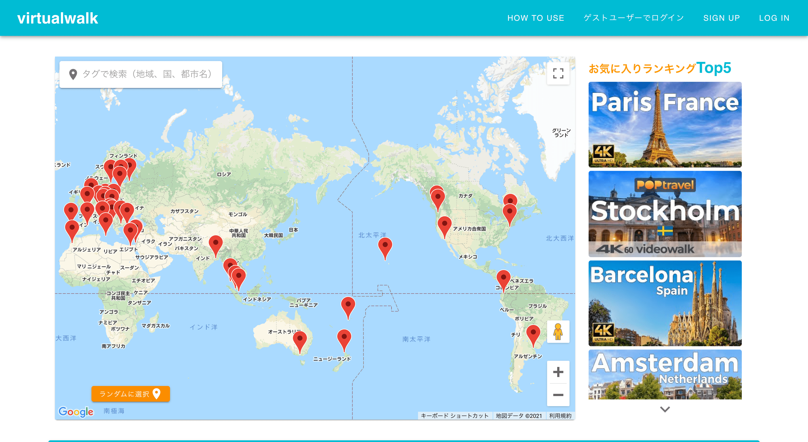
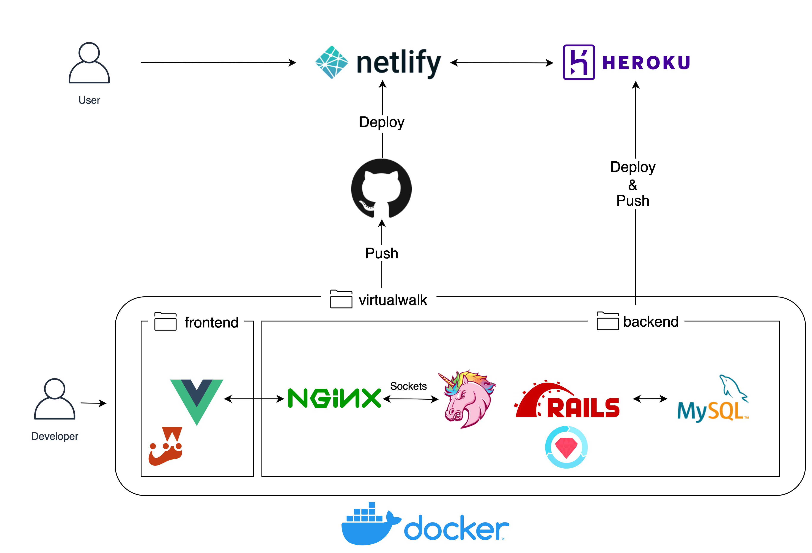
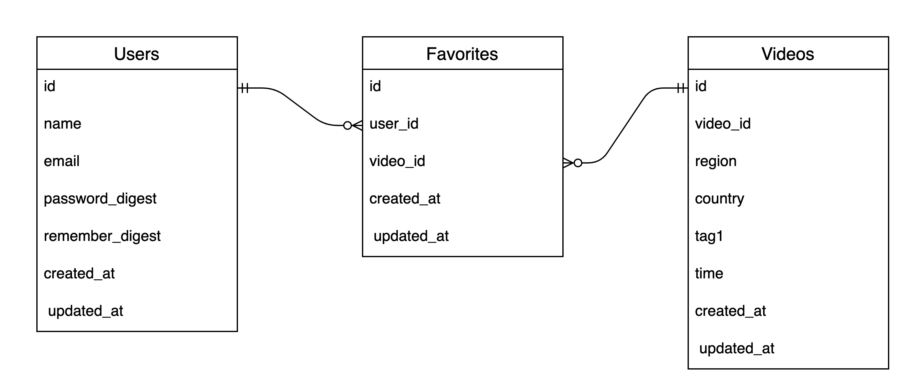

# virtualwalk
https://virtualwalk.netlify.app  
世界の風景を撮影した動画が集められたアプリケーションです。  
Youtube上にある様々な国や地域を徒歩で撮影した動画を集め、直感的に選択、閲覧できるようにしました。

## 工夫した点
* Vue.jsを採用したSPA化による静的ページ間のスムーズな移動  
* Googleマップ上に撮影場所をマッピングした直感的な動画選択機能  
* ゲストユーザーによるログイン（ユーザーデータの変更、ログアウト、退会可能）  
* 登録したユーザーが利用できる動画のお気に入り追加・削除  
* お気に入りの動画の中でもお気に入りのシーンにコメントを付けて保存・管理できるメモ機能  
* ユーザー登録、退会、ログイン、ログアウト、お気に入り追加、削除時に表示されるスナックバーの設計  
* お気に入りされた回数が多い上位５つの動画を表示するランキング  
* 選択した動画の開始時間と再生時間を指定できるカスタマイズ機能  
* 検索ワードと一致するタグが付けられた動画を一覧表示する動画検索機能  
* 動画選択するのが面倒な時に勝手に動画を選んでくれるランダム選択機能  
* 個々の動画を地域別に分けた検索タブ  
* 画面幅に応じてコンポーネントの配置を変えた見やすいUI設計(レスポンシブ対応)  

## 使用技術
#### バックエンド
* Ruby 2.6.6  
* Ruby on Rails 6.1.3  
* MySQL 5.7  
* Nginx 1.15.8  
#### フロントエンド
* Vue.js 2.6.11
* Vue CLI 4.5
#### その他
Docker|Docker-compose

 
#### gem
* rack-cors (1.1.1)  
* unicorn (6.0.0)  
* rails_same_site_cookie (0.1.8)  
* rspec-rails (5.0.1)  
* spring-commands-rspec (1.0.4)  
* factory_bot_rails (6.1.0)  

#### npm
* vue-router (3.2.0) (SPA化)
* vuetify (2.4.0) (CSSコンポーネントライブラリ)
* axios (0.21.1) (外部APIとの通信)
* google-maps-api-loader (1.1.1) (Googleマップのカスタマイズ)
* vue2-timepicker (1.1.6) (時間を設定できるUIコンポーネント)
* @vue/test-utils (1.0.3) (Jestの追加)